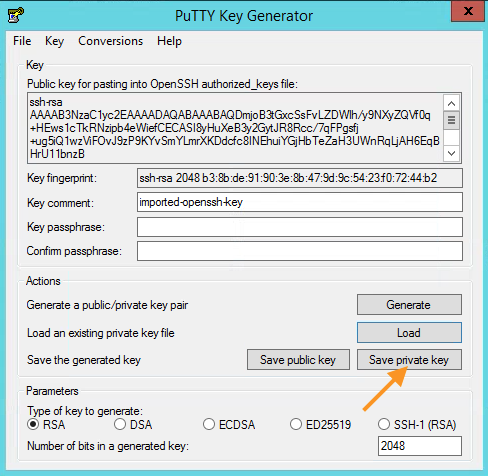

# Adding additional volumes (storage drives)

**Suhas Somnath**<br>
Advanced Data and Workflows Group<br>
National Center for Computational Sciences

10/9/2017

**Note that this document is a work in progress and proceed with caution**

You cannot resize the boot volume size after your instance is created.
Two solutions to this are:

1.  Expanding your existing volume – If you ensured that your volume
    would not be deleted upon deletion of your instance and do not mind
    losing the IP address of your machine:
    1.  Delete your instance on Horizon
    2.  Go to the Volumes section and resize your volume.
    3.  Create a new instance and use this existing volume instead of
        creating a new one.
    4.  You would have to delete your instance

2.  Adding an additional volume – this requires you to do some sys admin
    work on your instance and is similar to working on a local Linux
    machine
    1.  Go to Horizon
    2.  Create a new volume
    3.  Attach it to your existing instance
    4.  Follow sys admin procedures to mount this volume (see below).


1.  Create a new volume on Horizon
    1.  Go to Horizon → Compute tab → Volumes sub-tab
        
    2.  Click on the Volumes tab...

2.  Attach this volume to your instance on Horizon
3.  [Format and mount the volume in your instance](https://docs.oracle.com/cloud/latest/computecs\_common/OCSUG/GUID-7393768A-A147-444D-9D91-A56550604EE5.htm\#OCSUG196):

Find out the name of the new volume:

```bash
$ lsblk
```

You should see something like:

```bash
# NAME   MAJ:MIN RM SIZE RO TYPE MOUNTPOINT
# vda    253:0    0   8G  0 disk 
# └─vda1 253:1    0   8G  0 part /
# vdb    253:16   0  80G  0 disk
```
Here _vdb_ is the volume we want to mount. Here's how we mount the volume:

```bash
$ sudo fdisk /dev/vdb
```
in the prompts do the following to set the correct flags:

* type: _c_ and hit _enter_
* type: _u_ and hit _enter_
* type: _w_ and hit _enter_

Next, find out what file system is being used on the boot drive, let’s use the same:

```bash
$ mount | grep "\^/dev"
```
This should show you something like:

```bash
# /dev/vda1 on / type ext4 (rw,relatime,data=ordered)
```
Make the file system on the new volume:

```bash
$ sudo mkfs -t ext4 /dev/vdb
```
If asked to overwrite the partition table, type: _y_ and hit _enter_

Make a new folder which is where the data will be stored.

```bash
$ cd \~
$ mdkir data
```
Finally mount the volume:

```bash
$ sudo mount /dev/vdb /home/cades/data
```

You should see two lines now:

```bash
# /dev/vda1 on / type ext4 (rw,relatime,data=ordered)
# /dev/vdb on /home/cades/data type ext4 (rw,relatime,data=ordered)
```
Verify that the mounting was done correctly:

```bash
$ lsblk
```
You should see something like:

```bash
# NAME MAJ:MIN RM SIZE RO TYPE MOUNTPOINT
# vda 253:0 0 8G 0 disk
# └─vda1 253:1 0 8G 0 part /
# vdb 253:16 0 80G 0 disk /home/cades/data
```
Check to see that data is indeed on the new volume:

```bash
$ df anaconda/
```
You should see something like:

```bash
# Filesystem 1K-blocks Used Available Use% Mounted on
# /dev/vda1 8065444 5962536 2086524 75% /
```
This indicates that anaconda is on the boot drive (_/dev/vda1_). 
Let's do the same for the newly mounted volume at _/data/_:

```bash
$ df data/
```
You should see something like:

```bash
# Filesystem 1K-blocks Used Available Use% Mounted on
# /dev/vdb 82438832 57088 78171056 1% /home/cades/data
```
Clearly, the new folder data is actually on the new volume _/dev/vdb_
while the other folder anaconda was on the boot drive _/dev/vda1_

Move any data from your fixed sized boot volume to the new volume:

```bash
$ sudo mv old/folder/on/boot/volume/\* data/
```
